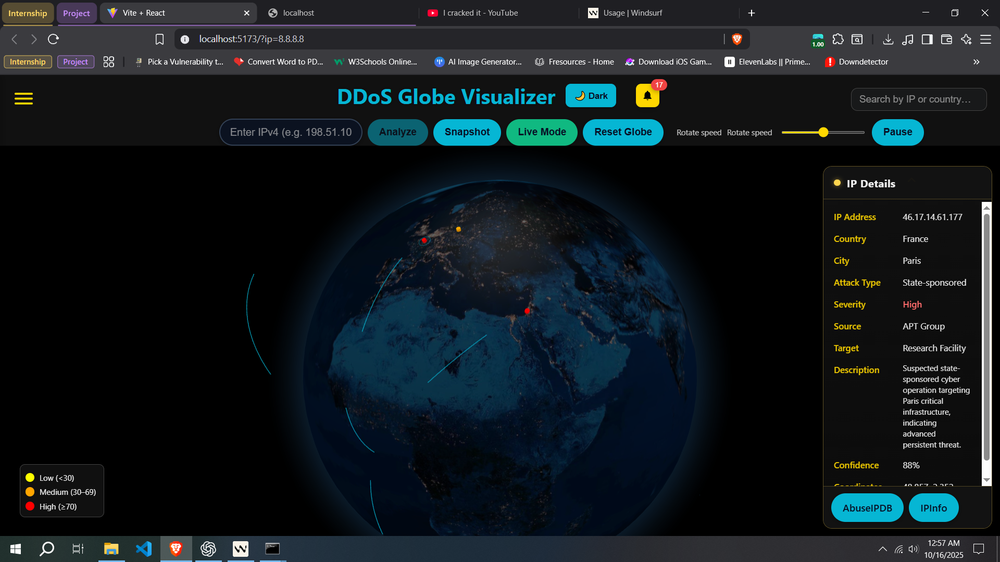
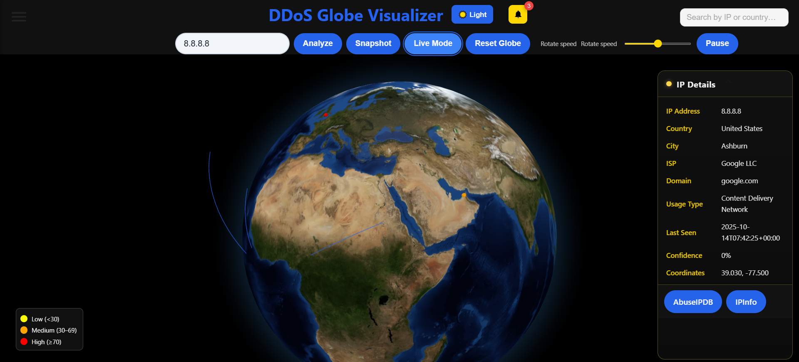
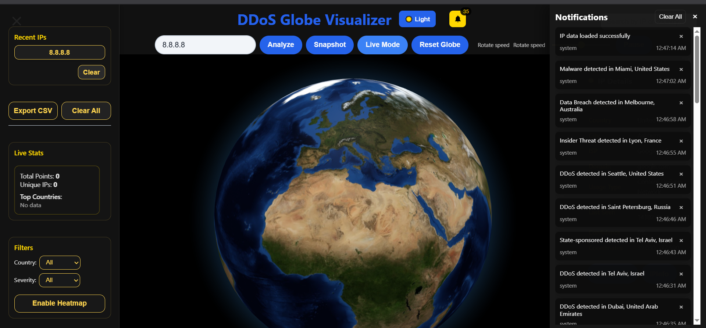

# 🌍 DDoS Globe Visualizer

A real-time 3D interactive globe visualization tool for analyzing IP addresses and monitoring global cyber threats. Built with FastAPI backend and React + Three.js frontend, featuring live threat intelligence from multiple sources including AbuseIPDB, ThreatFox, URLhaus, and AlienVault OTX.

[](https://opensource.org/licenses/MIT)
[](https://www.python.org/downloads/)
[](https://nodejs.org/)
[](https://fastapi.tiangolo.com/)
[](https://reactjs.org/)

---

## 📸 Screenshots

### 🎯 Live Attack Monitoring
Real-time visualization of global cyber threats with detailed attack information.

<div align="center">
  
  <p><i>Live threat feed showing DDoS attacks with severity indicators, attack types, and geographic distribution (Germany, Frankfurt)</i></p>
</div>

---

### 🔍 IP Address Analysis
Comprehensive IP lookup with geolocation, ISP information, and abuse confidence scoring.

<div align="center">
  
  <p><i>Analyzing Google DNS (8.8.8.8) with detailed information including country, city, ISP, domain, and usage type</i></p>
</div>

---

### 🔔 Notification System & Filtering
Advanced filtering system with real-time notifications for threat detection.

<div align="center">
  
  <p><i>Left sidebar showing recent IPs, export options, stats, and filters; right panel displaying real-time threat notifications from around the world</i></p>
</div>

---

## ✨ Key Features

### 🌐 **3D Globe Visualization**
- Interactive WebGL-powered 3D globe using Three.js and react-globe.gl
- Real-time point rendering with smooth animations
- Zoom, pan, and rotate controls for intuitive exploration
- Color-coded threat severity indicators (Low, Medium, High)

### ⚡ **Live Threat Intelligence**
- **Real-time attack feed** via WebSocket connections
- **Multiple threat sources**:
  - 🛡️ **ThreatFox** - C2 servers, botnets, malware infrastructure
  - 🔗 **URLhaus** - Malicious URLs and payload distribution
  - 🦠 **MalwareBazaar** - Malware samples and file hashes
  - 🔍 **AlienVault OTX** - Open Threat Exchange indicators
  - 📊 **AbuseIPDB** - IP abuse confidence scoring
- Cross-feed correlation for enhanced confidence scoring
- Event aggregation to prevent notification spam

### 🔎 **IP Address Analysis**
- Instant IPv4 address lookup and validation
- **Geographic data**: Coordinates, country, city, region
- **Network information**: ISP, organization, domain, usage type
- **Threat intelligence**: Abuse confidence score, report history, last seen
- Reverse DNS lookup
- Export results to CSV

### 🎨 **Modern User Interface**
- Dark/Light theme support
- Responsive design (desktop, tablet, mobile)
- Real-time toast notifications
- Interactive sidebar with filtering options
- Recent IP history tracking
- Live statistics dashboard

### 🗂️ **Advanced Filtering**
- Filter by country/region
- Severity level filtering (Low/Medium/High)
- Recent IPs tracking and quick access
- Export filtered data to CSV
- Clear all history option

### 🎛️ **Admin Dashboard**
- System health monitoring
- Active WebSocket connection tracking
- API service status checks (AbuseIPDB, GeoIP, Live Feeds)
- Cache management (view, clear)
- Error logs and diagnostics

### 💾 **Smart Caching System**
- Multi-tier caching (in-memory + SQLite)
- Automatic TTL-based expiration
- Reduced API calls and costs
- Faster response times
- Configurable cache duration

---

## 🚀 Quick Start

### **One-Click Launch (Windows)**

**First Time Setup:**
```bash
run_all.bat
```

**Quick Launch (After Initial Setup):**
```bash
run_quick.bat
```

The launcher will automatically:
- ✅ Verify Python and Node.js installation
- ✅ Create and activate virtual environment
- ✅ Install all dependencies
- ✅ Kill processes on ports 8000 and 5173
- ✅ Start backend (http://localhost:8000)
- ✅ Start frontend (http://localhost:5173)
- ✅ Open browser to application

---

### **Manual Setup**

#### Prerequisites
- **Python** 3.8 or higher
- **Node.js** 16 or higher
- **Internet connection** for API calls

#### Backend Setup
```bash
# Create virtual environment
python -m venv .venv

# Activate virtual environment
# Windows:
.venv\Scripts\activate
# Linux/Mac:
source .venv/bin/activate

# Install dependencies
pip install -r requirements.txt

# Start backend server
python backend/start_server.py
```

Backend will be available at **http://localhost:8000**

#### Frontend Setup
```bash
# Navigate to frontend directory
cd frontend

# Install dependencies
npm install

# Start development server
npm run dev
```

Frontend will be available at **http://localhost:5173**

---

## 🛠️ Configuration

### Environment Variables

Copy `.env.example` to `.env` and configure:

```env
# ========== Backend Configuration ==========

# Mode Settings
DShieldMode=live                    # live or mock
USE_MOCK_DATA=false                 # true to use sample data

# API Keys (Optional but Recommended)
ABUSEIPDB_KEY=your_api_key_here     # https://www.abuseipdb.com/api
OTX_API_KEY=your_otx_key_here       # https://otx.alienvault.com
ABUSECH_AUTH_KEY=your_key_here      # abuse.ch authentication

# Polling Intervals (seconds)
ABUSEIPDB_INTERVAL=300              # AbuseIPDB polling
DSHIELD_INTERVAL=300                # DShield polling
LIVEFEED_POLL_INTERVAL_SEC=30       # Live feed refresh
MAX_CACHE_AGE_SEC=3600              # Cache expiration
LIVEFEED_MAX_BUFFER=5000            # Max buffered events

# GeoIP Database
GEOLITE_DB_PATH=ml_model/GeoLite2-City.mmdb

# Server Settings
WS_HOST=0.0.0.0                     # Server bind address
WS_PORT=8000                        # Server port
DEBUG=false                         # Debug mode

# ========== Frontend Configuration ==========

VITE_BACKEND_URL=http://127.0.0.1:8000        # Backend API URL
VITE_WS_URL=ws://127.0.0.1:8000/ws/live       # WebSocket URL
```

### API Keys (Free Tiers Available)

| Service | Required | Free Tier | Get Key |
|---------|----------|-----------|---------|
| **AbuseIPDB** | Optional | 1,000 requests/day | [Get Key](https://www.abuseipdb.com/api) |
| **AlienVault OTX** | Optional | Unlimited | [Get Key](https://otx.alienvault.com) |
| **ThreatFox** | No | Unlimited | No key needed |
| **URLhaus** | No | Unlimited | No key needed |
| **MalwareBazaar** | No | Unlimited | No key needed |

---

## 📊 System Architecture

```
┌─────────────────────────────────────────────────────────────┐
│                    Frontend (React + Vite)                   │
│  ┌──────────────┐  ┌──────────────┐  ┌──────────────┐      │
│  │ Globe View   │  │ IP Analysis  │  │ Live Feed    │      │
│  │ (Three.js)   │  │ Component    │  │ Dashboard    │      │
│  └──────────────┘  └──────────────┘  └──────────────┘      │
└───────────────────────────┬─────────────────────────────────┘
                            │ WebSocket + REST API
┌───────────────────────────┴─────────────────────────────────┐
│                   Backend (FastAPI + Uvicorn)                │
│  ┌──────────────┐  ┌──────────────┐  ┌──────────────┐      │
│  │ REST API     │  │ WebSocket    │  │ Admin Panel  │      │
│  │ Endpoints    │  │ Handlers     │  │ Dashboard    │      │
│  └──────────────┘  └──────────────┘  └──────────────┘      │
│  ┌────────────────────────────────────────────────────┐     │
│  │          Service Layer (Business Logic)            │     │
│  │  ┌───────────┐ ┌───────────┐ ┌───────────┐        │     │
│  │  │  GeoIP    │ │ AbuseIPDB │ │ Live Feed │        │     │
│  │  │  Service  │ │  Service  │ │  Service  │        │     │
│  │  └───────────┘ └───────────┘ └───────────┘        │     │
│  └────────────────────────────────────────────────────┘     │
│  ┌────────────────────────────────────────────────────┐     │
│  │         Cache Layer (SQLite + In-Memory)           │     │
│  └────────────────────────────────────────────────────┘     │
└───────────────────────────┬─────────────────────────────────┘
                            │
┌───────────────────────────┴─────────────────────────────────┐
│                    External APIs                             │
│  ┌──────────────┐  ┌──────────────┐  ┌──────────────┐      │
│  │  IP-API.com  │  │  AbuseIPDB   │  │  ThreatFox   │      │
│  │  (GeoIP)     │  │ (Threat Intel)│  │  URLhaus, etc│      │
│  └──────────────┘  └──────────────┘  └──────────────┘      │
└─────────────────────────────────────────────────────────────┘
```

---

## 🔌 API Endpoints

### REST API
- `GET /health` - Health check and system status
- `GET /analyze_ip?ip={ip}` - Analyze specific IP address
- `GET /check_ip?ip={ip}` - Quick IP check
- `GET /admin` - Admin dashboard UI
- `GET /api/admin/status` - System status and diagnostics
- `POST /api/admin/clear-cache` - Clear all caches

### WebSocket
- `/ws/live` - Live threat feed stream (real-time events)

---

## 🎯 Usage Guide

### 1️⃣ **Analyzing an IP Address**
1. Enter an IPv4 address in the search box (e.g., `8.8.8.8`)
2. Click **"Analyze"** button
3. View results on the globe and in the IP Details panel
4. Check abuse confidence score and threat information

### 2️⃣ **Live Threat Monitoring**
1. Click **"Live Mode"** button to activate
2. Watch real-time threats appear on the globe
3. View attack details in the IP Details panel
4. Monitor notifications in the right panel

### 3️⃣ **Using Filters**
1. Open the left sidebar
2. Select country from dropdown
3. Set severity level filter
4. View filtered results and statistics

### 4️⃣ **Exporting Data**
1. Analyze one or more IPs
2. Click **"Export CSV"** in the sidebar
3. Save the file with complete IP analysis data

### 5️⃣ **Admin Dashboard**
1. Navigate to http://localhost:8000/admin
2. View system health status
3. Check API connectivity
4. Clear caches if needed

---

## 🏗️ Technology Stack

### Backend
- **FastAPI** - Modern Python web framework
- **Uvicorn** - Lightning-fast ASGI server
- **HTTPx** - Async HTTP client for API calls
- **SQLite** - Lightweight caching database
- **Pydantic** - Data validation and serialization
- **python-dotenv** - Environment configuration

### Frontend
- **React 19** - UI library with modern hooks
- **Vite** - Next-generation build tool
- **Three.js / react-globe.gl** - 3D globe visualization
- **Tailwind CSS** - Utility-first CSS framework
- **Axios** - HTTP client
- **React Hot Toast** - Elegant notifications

### Data Sources
- **AbuseIPDB** - IP abuse database and confidence scoring
- **ThreatFox (abuse.ch)** - C2 servers and malware infrastructure
- **URLhaus (abuse.ch)** - Malicious URL database
- **MalwareBazaar (abuse.ch)** - Malware sample repository
- **AlienVault OTX** - Open Threat Exchange
- **IP-API.com** - IP geolocation service
- **GeoLite2** - MaxMind geolocation database

---

## 📚 Documentation

- **Architecture Details**: See [`docs/ARCHITECTURE.md`](docs/ARCHITECTURE.md)
- **Feature Overview**: See [`docs/FEATURES.md`](docs/FEATURES.md)
- **Troubleshooting**: See [`TROUBLESHOOTING.md`](TROUBLESHOOTING.md)
- **Contributing Guidelines**: See [`CONTRIBUTING.md`](CONTRIBUTING.md)
- **Code of Conduct**: See [`CODE_OF_CONDUCT.md`](CODE_OF_CONDUCT.md)
- **Changelog**: See [`CHANGELOG.md`](CHANGELOG.md)

---

## 🐛 Troubleshooting

### Common Issues

**Port Already in Use**
```bash
# Windows
netstat -ano | findstr :8000
netstat -ano | findstr :5173
taskkill /PID <PID> /F

# Linux/Mac
lsof -i :8000
lsof -i :5173
kill -9 <PID>
```

**Module Not Found Errors**
```bash
# Backend
pip install -r requirements.txt

# Frontend
cd frontend
npm install
```

**WebSocket Connection Failed**
- Check backend is running on port 8000
- Verify `VITE_WS_URL` in `.env` is correct
- Check firewall settings

For more solutions, see [`TROUBLESHOOTING.md`](TROUBLESHOOTING.md)

---

## 🔒 Security Best Practices

- ✅ Never commit `.env` file to version control
- ✅ Use environment variables for all API keys
- ✅ Regularly update dependencies (`npm audit fix`, `pip list --outdated`)
- ✅ Implement rate limiting in production
- ✅ Use HTTPS/WSS for production deployments
- ✅ Restrict CORS origins in production
- ✅ Keep API keys secure and rotate regularly

---

## 🚀 Production Deployment

### Recommended Setup
1. **Reverse Proxy**: Use nginx or Apache
2. **Process Manager**: Use systemd, PM2, or supervisord
3. **HTTPS**: Enable SSL/TLS with Let's Encrypt
4. **Environment**: Separate dev/staging/prod configs
5. **Monitoring**: Set up logging and error tracking
6. **Backups**: Regular database and config backups

### Docker Support (Coming Soon)
Docker and Docker Compose configurations will be added in a future release.

---

## 🤝 Contributing

We welcome contributions from the community! Here's how you can help:

### Ways to Contribute
- 🐛 Report bugs and issues
- 💡 Suggest new features
- 📝 Improve documentation
- 🔧 Submit pull requests
- ⭐ Star the repository

### Contribution Process
1. Fork the repository
2. Create a feature branch (`git checkout -b feature/AmazingFeature`)
3. Commit your changes (`git commit -m 'Add some AmazingFeature'`)
4. Push to the branch (`git push origin feature/AmazingFeature`)
5. Open a Pull Request

Please read [`CONTRIBUTING.md`](CONTRIBUTING.md) for detailed guidelines.

---

## 📄 License

This project is licensed under the **MIT License** - see the [`LICENSE`](LICENSE) file for details.

```
MIT License

Copyright (c) 2025 DDoS Globe Contributors

Permission is hereby granted, free of charge, to any person obtaining a copy
of this software and associated documentation files (the "Software"), to deal
in the Software without restriction, including without limitation the rights
to use, copy, modify, merge, publish, distribute, sublicense, and/or sell
copies of the Software, and to permit persons to whom the Software is
furnished to do so, subject to the following conditions:

The above copyright notice and this permission notice shall be included in all
copies or substantial portions of the Software.
```

---

## 🌟 Acknowledgments

- **FastAPI** - For the amazing Python web framework
- **React** & **Three.js** - For powerful frontend technologies
- **AbuseIPDB** - For threat intelligence data
- **Abuse.ch** - For ThreatFox, URLhaus, and MalwareBazaar feeds
- **AlienVault** - For OTX threat intelligence
- **MaxMind** - For GeoLite2 database
- **IP-API.com** - For geolocation services

---

## 📞 Support & Contact

- **Issues**: [GitHub Issues](https://github.com/yourusername/ddos-globe-visualizer/issues)
- **Documentation**: Check `docs/` folder and markdown files
- **Discussions**: [GitHub Discussions](https://github.com/yourusername/ddos-globe-visualizer/discussions)

---

## 📈 Project Stats

- **Version**: 1.0.0
- **Status**: Production Ready ✅
- **Language**: Python + JavaScript
- **Framework**: FastAPI + React
- **License**: MIT

---

## 🎯 Roadmap

### Current Version (v1.0.0)
- ✅ 3D Globe visualization
- ✅ Real-time threat feed
- ✅ IP analysis with abuse scoring
- ✅ Multiple threat intelligence sources
- ✅ Admin dashboard
- ✅ Export functionality
- ✅ Dark/Light themes

### Planned Features (Future Releases)
- [ ] Historical data analysis and charts
- [ ] Custom threat feed integration
- [ ] Email/Webhook alerting system
- [ ] Multi-user authentication
- [ ] Advanced analytics dashboard
- [ ] Machine learning threat prediction
- [ ] Mobile app (React Native)
- [ ] Docker containerization
- [ ] Kubernetes deployment configs
- [ ] IPv6 support

---

<div align="center">

### ⭐ If you find this project useful, please give it a star!

**Made with ❤️ by cybersecurity enthusiasts**

[Report Bug](https://github.com/yourusername/ddos-globe-visualizer/issues) · [Request Feature](https://github.com/yourusername/ddos-globe-visualizer/issues) · [Documentation](docs/)

</div>

---

**⚠️ Disclaimer**: This tool is for educational and legitimate cybersecurity purposes only. All data is sourced from public threat intelligence APIs and databases. Use responsibly and in compliance with all applicable laws, regulations, and API terms of service. The authors are not responsible for misuse of this software.
