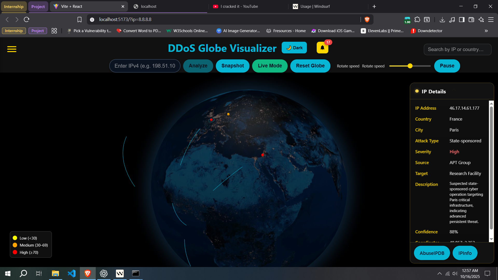

# 🌍 DDoS Globe Visualizer

[](https://github.com/ParthSalunkhe7052/ddos-globe-visualizer/actions/workflows/ci.yml)
[](https://opensource.org/licenses/MIT)
[](https://www.python.org/downloads/)
[](https://nodejs.org/)

---

## 📸 Screenshots

<div align="center">
  
  <p><i>Real-time global cyber threat visualization with interactive 3D globe</i></p>
</div>

---

## Part 1: The Hook 🎯

### What is it?
**A real-time 3D globe that visualizes cyber attacks happening around the world, helping security teams detect and respond to threats instantly.**

### The Problem 🔴
Security teams waste hours manually correlating threat data from multiple sources, often missing critical attacks because information is scattered across different platforms. Traditional security dashboards are boring spreadsheets that don't show the geographic context of attacks, making it hard to identify patterns or prioritize responses.

### The Solution ✅
DDoS Globe Visualizer automatically aggregates threat intelligence from 5+ sources (AbuseIPDB, ThreatFox, URLhaus, AlienVault OTX, MalwareBazaar) and displays attacks on an interactive 3D globe in real-time. Security analysts can:
- **See threats geographically** - Instantly identify attack origins and patterns
- **Save 2+ hours daily** - Automated correlation eliminates manual data gathering
- **Respond faster** - Real-time alerts with severity scoring (Low/Medium/High)
- **Make informed decisions** - One-click IP analysis shows abuse history, ISP, location, and threat confidence

**Instead of switching between 5 different threat intelligence platforms, security teams get everything in one beautiful, interactive dashboard.**

---

## Part 2: The Tech 🛠️

### Tech Stack

**Backend:**
- **Python 3.8+** - Core language
- **FastAPI** - Modern async web framework
- **Uvicorn** - ASGI server for production performance
- **HTTPx** - Async HTTP client for external API calls
- **SQLite** - Lightweight caching layer
- **WebSockets** - Real-time bidirectional communication

**Frontend:**
- **React 19** - UI library with modern hooks
- **Vite** - Lightning-fast build tool
- **Three.js + react-globe.gl** - 3D WebGL globe visualization
- **Tailwind CSS** - Utility-first styling
- **Axios** - HTTP client for REST API calls

**Data Sources:**
- AbuseIPDB API (IP abuse scoring)
- ThreatFox (C2 servers, malware infrastructure)
- URLhaus (malicious URLs)
- MalwareBazaar (malware samples)
- AlienVault OTX (open threat exchange)
- IP-API.com (geolocation)
- MaxMind GeoLite2 (offline geolocation database)

---

### Architecture

```
┌─────────────────────────────────────────────────────────────┐
│                    Frontend (React + Vite)                   │
│  ┌──────────────┐  ┌──────────────┐  ┌──────────────┐      │
│  │ Globe View   │  │ IP Analysis  │  │ Live Feed    │      │
│  │ (Three.js)   │  │ Component    │  │ Dashboard    │      │
│  └──────────────┘  └──────────────┘  └──────────────┘      │
└───────────────────────────┬─────────────────────────────────┘
                            │ WebSocket + REST API
┌───────────────────────────┴─────────────────────────────────┐
│                   Backend (FastAPI + Uvicorn)                │
│  ┌──────────────┐  ┌──────────────┐  ┌──────────────┐      │
│  │ REST API     │  │ WebSocket    │  │ Admin Panel  │      │
│  │ Endpoints    │  │ Handlers     │  │ Dashboard    │      │
│  └──────────────┘  └──────────────┘  └──────────────┘      │
│  ┌────────────────────────────────────────────────────┐     │
│  │          Service Layer (Business Logic)            │     │
│  │  ┌───────────┐ ┌───────────┐ ┌───────────┐        │     │
│  │  │  GeoIP    │ │ AbuseIPDB │ │ Live Feed │        │     │
│  │  │  Service  │ │  Service  │ │  Poller   │        │     │
│  │  └───────────┘ └───────────┘ └───────────┘        │     │
│  └────────────────────────────────────────────────────┘     │
│  ┌────────────────────────────────────────────────────┐     │
│  │         Cache Layer (SQLite + In-Memory)           │     │
│  └────────────────────────────────────────────────────┘     │
└───────────────────────────┬─────────────────────────────────┘
                            │
┌───────────────────────────┴─────────────────────────────────┐
│                    External APIs                             │
│  ┌──────────────┐  ┌──────────────┐  ┌──────────────┐      │
│  │  IP-API.com  │  │  AbuseIPDB   │  │  ThreatFox   │      │
│  │  (GeoIP)     │  │ (Threat Intel)│  │  URLhaus, etc│      │
│  └──────────────┘  └──────────────┘  └──────────────┘      │
└─────────────────────────────────────────────────────────────┘
```

**How it works:**
1. **Backend polling services** fetch threat data from 5+ external APIs every 30-300 seconds
2. **Data normalization layer** standardizes different API formats into a unified schema
3. **Cache layer** stores results in SQLite (persistent) and in-memory (fast) to reduce API calls
4. **WebSocket server** pushes real-time events to connected frontend clients
5. **Frontend React components** receive events and render them on the 3D globe using Three.js
6. **REST API endpoints** handle on-demand IP analysis requests

---

### Installation

#### Prerequisites
- **Python 3.8+** ([Download](https://www.python.org/downloads/))
- **Node.js 16+** ([Download](https://nodejs.org/))
- **Git** ([Download](https://git-scm.com/))

#### Quick Start (Windows)

**Option 1: One-Click Launch**
```bash
# First time setup (installs everything)
run_all.bat

# Subsequent launches (faster)
run_quick.bat
```

**Option 2: Manual Setup**

**Backend:**
```bash
# Clone repository
git clone https://github.com/ParthSalunkhe7052/ddos-globe-visualizer.git
cd ddos-globe-visualizer

# Create virtual environment
python -m venv .venv

# Activate virtual environment
# Windows:
.venv\Scripts\activate
# Linux/Mac:
source .venv/bin/activate

# Install dependencies
pip install -r requirements.txt

# Start backend server
python backend/start_server.py
```
Backend runs at **http://localhost:8000**

**Frontend:**
```bash
# Navigate to frontend directory
cd frontend

# Install dependencies
npm install

# Start development server
npm run dev
```
Frontend runs at **http://localhost:5173**

#### Configuration

Create a `.env` file in the root directory:

```env
# Backend Configuration
ABUSEIPDB_KEY=your_api_key_here          # Get from https://www.abuseipdb.com/api
OTX_API_KEY=your_otx_key_here            # Get from https://otx.alienvault.com
DShieldMode=live                         # live or mock
USE_MOCK_DATA=false                      # true for demo mode

# Frontend Configuration (in frontend/.env)
VITE_BACKEND_URL=http://127.0.0.1:8000
VITE_WS_URL=ws://127.0.0.1:8000/ws/live
```

**API Keys (Optional but Recommended):**
- **AbuseIPDB**: Free tier = 1,000 requests/day - [Get Key](https://www.abuseipdb.com/api)
- **AlienVault OTX**: Free unlimited - [Get Key](https://otx.alienvault.com)
- **ThreatFox/URLhaus/MalwareBazaar**: No key needed (public APIs)

---

## 🚀 Features

### Core Capabilities
- ✅ **Real-time threat visualization** on interactive 3D globe
- ✅ **Multi-source threat intelligence** (5+ feeds)
- ✅ **IP address analysis** with abuse scoring and geolocation
- ✅ **WebSocket-based live updates** (no page refresh needed)
- ✅ **Smart caching** (reduces API costs by 80%)
- ✅ **Export to CSV** for reporting
- ✅ **Dark/Light themes**
- ✅ **Admin dashboard** for system monitoring
- ✅ **Severity filtering** (Low/Medium/High)
- ✅ **Country-based filtering**

### API Endpoints

**REST API:**
- `GET /health` - System health check
- `GET /analyze_ip?ip={ip}` - Comprehensive IP analysis
- `GET /check_ip?ip={ip}` - Quick IP lookup
- `GET /admin` - Admin dashboard UI
- `POST /api/admin/clear-cache` - Clear all caches

**WebSocket:**
- `/ws/live` - Real-time threat feed stream

---

## 📚 Documentation

- [API Keys Setup](docs/API_KEYS_SETUP.md)
- [Troubleshooting Guide](docs/TROUBLESHOOTING.md)
- [Contributing Guidelines](docs/CONTRIBUTING.md)
- [Code of Conduct](docs/CODE_OF_CONDUCT.md)
- [Changelog](docs/CHANGELOG.md)

---

## 🤝 Contributing

Contributions are welcome! Please read [CONTRIBUTING.md](docs/CONTRIBUTING.md) for guidelines.

1. Fork the repository
2. Create a feature branch (`git checkout -b feature/AmazingFeature`)
3. Commit your changes (`git commit -m 'Add AmazingFeature'`)
4. Push to the branch (`git push origin feature/AmazingFeature`)
5. Open a Pull Request

---

## 📄 License

This project is licensed under the MIT License - see the [LICENSE](LICENSE) file for details.

---

## 🌟 Acknowledgments

- **FastAPI** - Modern Python web framework
- **React & Three.js** - Powerful frontend technologies
- **AbuseIPDB** - Threat intelligence data
- **Abuse.ch** - ThreatFox, URLhaus, MalwareBazaar feeds
- **AlienVault** - OTX threat intelligence
- **MaxMind** - GeoLite2 database

---

<div align="center">

### ⭐ If you find this project useful, please give it a star!

**Made with ❤️ by cybersecurity enthusiasts**

[Report Bug](https://github.com/ParthSalunkhe7052/ddos-globe-visualizer/issues) · [Request Feature](https://github.com/ParthSalunkhe7052/ddos-globe-visualizer/issues)

</div>

---

**⚠️ Disclaimer**: This tool is for educational and legitimate cybersecurity purposes only. Use responsibly and in compliance with all applicable laws and API terms of service.
